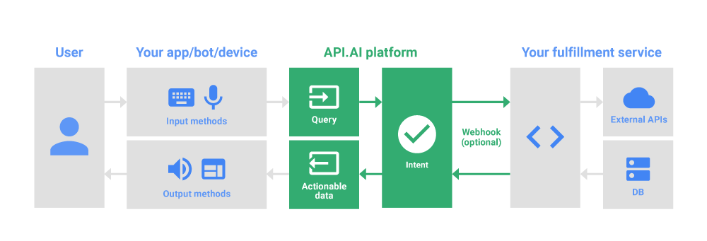

# Map-Bot

* Map Bot is a chatbot interface to Google/Bing Maps. 
* The user can ask anything from ratings/reviews to directions for any place across the globe.
* API.AI was used for natural language processing. 
* API.AI forms a JSON object containing the extracted keywords from the user input and sends it to the service which I've hosted on Heroku. 
* The API.AI agent named 'MapBot' has been integrated with facebook, so the user can chat with the bot using facebook messenger.

## Architecture

## Sample Conversation

